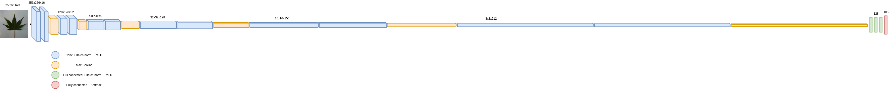

# Happi
Leaf classifier embedded into a Raspberry-pi.

## Data
First, I will use the LeafsnapDataset [1].
The dataset (field + lab) was randomly split into a train set (80%) and a test set (20%).

## Simple Convolutional Neural Network

Hyper-parameters:
* Number of convolutional blocks: 6
  * Number of convolutional layer / block: 2
  * Number of convolutional filters:
    * 1st block: 16
    * 2nd block: 32
    * 3rd block: 64
    * 4th block: 128
    * 5th block: 256
    * 6th block: 512
* Number of fully-connected layers: 3
  * 128 neurons per layer
* A last fully-connected layer (class evidences) + softmax
* Initialization: He
* Mini-batch size: 8
* Learning rate: 0.0005
* Optimizer: Adam
* Number of training epochs: 250
* Input images resized to: 256x256

[1] "Leafsnap: A Computer Vision System for Automatic Plant Species Identification,"
Neeraj Kumar, Peter N. Belhumeur, Arijit Biswas, David W. Jacobs, W. John Kress, Ida C. Lopez, João V. B. Soares,
Proceedings of the 12th European Conference on Computer Vision (ECCV),
October 2012 ([Leafsnap-dataset webpage](http://leafsnap.com/))
